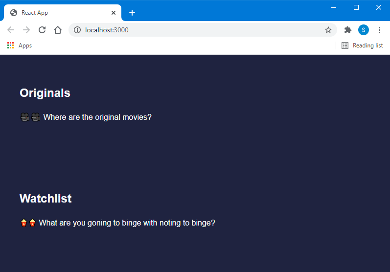

# ⚛️ React Technical Challenge @ PNNL

This challenge is part of the hiring process at PNNL. The idea is to make as much progress as possible in 20 minutes or less. This is not a pass or fail challenge, and if you will get up to 24 hours to complete it.

**(optional)** If time permits within the 24 hour time frame show us what you got by "improving" this application. This is an optional step and will NOT affect the hiring process.

## What you're building

# 🐛 Watch out for that bug!
To test your debugging abilities we've left a small furry bug in the system.

# 🚧 Background
You're a developer building the latest and greatest movie watching app. Arriving at your workstation one morning your manager pings you. You're told that you need to write a critical piece of the application, and oh yeah, it was due two days ago!!!

# 📃 Acceptance Criteria
1. The customer will see a list of movies they can add to their watchlist.
2. The customer can add movies to their watchlist.
3. The customer can remove movies from their watchlist.

# 👨‍💻 Technical Notes
## Fetch Data
Fetch the movies from the endpoint [https://swapi.dev/api/films/](https://swapi.dev/api/films/). This endpoint returns an array of movies.
**NOTE** the components are already setup to parse the properties. All you have to do is provide it with the data.

## Watchlist
1. Determine the best way to store the movies in the customers watch list.
2. Allow the customers to add or remove a movie from their watchlist.
